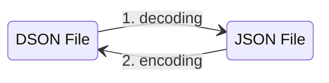
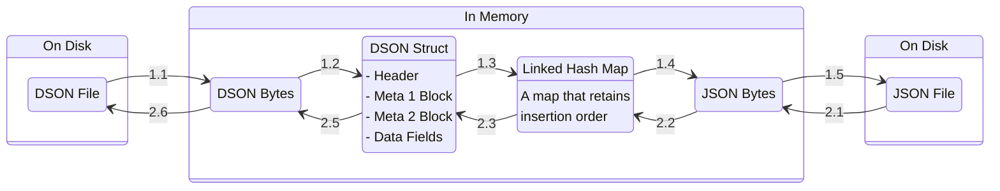

# DSON

**DSON** stands for **Darkest** Dungeon **JSON**, which is a proprietary data format created by Red Hook Studios.

Terminology and high level implementation were mostly based on documentation by robojumper with his
[DarkestDungeonSaveEditor](https://github.com/robojumper/DarkestDungeonSaveEditor/blob/master/docs/dson.md).

Decoding DSON code is a port from an
[unfinished implementation in Janet](https://github.com/thanhnguyen2187/darkest-savior/blob/master/darkest-savior/dson.janet)
.

## Motivation

The original implementation was in Java and in Rust, which... worked well enough, but I wanted to do something more for
a few reasons, in no particular order:

- Scratch my own itch on having a corrupted save file
- Using Go, which is kind of my "second" professional language. I wanted to improve my skills and see how it goes.
- An attempt at working in a lower level than my usual jobs (I mostly worked in backend, a.k.a. making data
  transformations and gluing 3rd-party libraries together to create JSON responses).

## Terminology

- `Header`: header of a DSON file; contains magic number and other general data
- `Meta1Block`: a section that contains metadata on each object in a DSON file
- `Meta1Entry`: an entry of `Meta1Block`
- `Meta2Block`: a section that contains metadata on each `Field` (JSON key-value pair) in a DSON file
- `Meta2Entry`: an entry of `Meta2Block`
- `Field`: a data unit that is equivalent to a key-value pair of JSON
- `Decode`: read bytes to raw data structures (`Header`, `Meta1Block`, `Meta2Block`, and `Field`)
- `Infer`: infer more meaningful data from raw data structures (result in `Meta1BlockInferences`, `Meta2BlockInferences`
  , etc.)
- `Imply`: the reversed process of `Infer`, where `DataType` is guessed from the values from a JSON file

## DSON structure

A DSON file generally consists of four parts:

- `Header`: magic number and other stuff
- `Meta1Block`: metadata of `Field`s that are objects
- `Meta2Block`: metadata of each `Field`
- `DataFields`: the actual data

More information can be found from the
[original documentation](https://github.com/robojumper/DarkestDungeonSaveEditor/blob/master/docs/dson.md)
of robojumper.

In my own words, a JSON file like this:

```json
{
  "1": "2",
  "3": {
    "4": 5,
    "6": "seven"
  }
}
```

Is DSON-structured like this, in the simplest sense (I am skipping the binary parts for simplicity's sake):

```json
{
  "header": {},
  "meta_1_block": [
    {
      "field_name": "3"
    }
  ],
  "meta_2_block": [
    {
      "field_name": "1",
      "field_value": "2"
    },
    {
      "field_name": "3",
      "field_value": null
    },
    {
      "field_name": "4",
      "field_value": 5
    },
    {
      "field_name": "6",
      "field_value": "seven"
    }
  ]
}
```

There are more quirks to learn in details, but I think it is enough for now.

## Decoding and Encoding DSON

We can think of the processes as converting from DSON to JSON and vice versa.



In more details:



There is not a lot to say about `1.1`, `2.6`, `1.5`, and `2.1`, since bytes reading and writing are built into Golang.
Interesting stories of other processes are to be told, however.

`1.2` seems straight forward, but actually is not that simple, when it comes to `DataFields`. The reason is a
`DataField` consists of two parts:

- `FieldName`: its length are took from the corresponding `Meta2Entry`.
- `RawData`: it is zeroes-padded at the start, depends on its offset on disk. The rule is: if the actual raw data has
  its length less than 4, then nothing is padded. Equal or more than four means it is 4-bytes padded by the offset, and
  the field name's length.

Being unable to figure out the step `1.3`, and the `LinkedHashMap` usage, is the reason why I scraped my first
implementation with Janet. Finding a "good" `LinkedHashMap` also was interesting. At first, I used `emirpasic/gods`'s
`LinkedHashMap`, but only in step `2.2` that I realized that the `json.Unmarshal` implementation was not good enough for
me: it tries to sort the keys by it appearance in the map. It means this data:

```json
{
  "one": "1",
  "two": {
    "three": "3",
    "one": "1"
  }
}
```

Is going to become this in memory:

```json
{
  "one": "1",
  "two": {
    "one": "2",
    "three": "3"
  }
}
```

Since `"one"` is the first key of the whole object, even if it appears after `"three"` within `"two"`.

TODO: write the rest

With decoding, nothing too fancy is implemented. `Decode` functions expect a `BytesReader`, which is a wrapper around
`bytes.Reader` with some additional utilities like converting the read bytes to integer, or to a string.

As the manual mapping from `BytesReader` to raw data structures contains too much boilerplate code, an attempt of using
`ReadingInstruction` and `ExecuteInstructions` is used.

The decoding process seems straight forward with `Header`, `Meta1Block`, and `Meta2Block`, but becomes more nuance with
`Field`, as there is no concrete rule on the fields' data types. Also, a special data type named "linked hash map", or
"map/dictionary with insertion order" is needed, since that is what the second process (encoding) needs.

The encoding process also seems straight forward, but a lot of time and efforts were spent on fighting between the
program's own `DataType` definitions and Golang's type system from JSON deserializing process.
